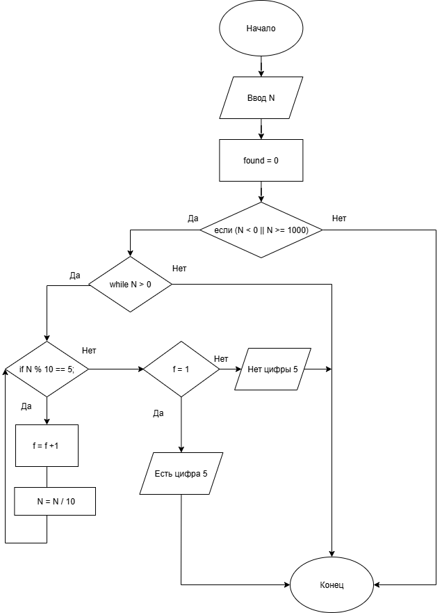

# Домашняя работа 6
## Условие задачи
Вариант 6. 

Дано число N (N<1000). Написать программу, которая проверяет входит ли в него цифра 5.
## 1. Алгоритм и блок-схема

### Алгоритм
1. **Начало**
  
2. Ввод числа N.
3. Проверка, что число N < 1000 и N >= 0.
   - Если да, перейти к следующему шагу
   - Если нет, вывести сообщение об ошибке и завершить
4. Присвоить temp = N
5. Проверка, есть ли в числе цифра 5.
   - Пока temp > 0:
   - Проверить temp % 10 == 5
   - Если да, вывести "В числе есть цифра 5" 
   - Если нет, temp = temp / 10
 6. Если цикл завершён (функция не завершилась досрочно), вывести "В числе нет цифры 5".
7. **Конец**

### Блок-схема

https://viewer.diagrams.net/?tags=%7B%7D&lightbox=1&highlight=0000ff&edit=_blank&layers=1&nav=1&title=6.png&dark=auto#R%3Cmxfile%3E%3Cdiagram%20name%3D%22%D0%A1%D1%82%D1%80%D0%B0%D0%BD%D0%B8%D1%86%D0%B0%20%E2%80%94%201%22%20id%3D%22tjUwCf0osmfEOlQWq29F%22%3E7Vxbc9o4FP41zHQfwsiSr48hSdud6XY6k4dt9s0BAd4YixUmgf76lWzJF0mAE4wpcTodx5ZlXb%2FznYtOMkA3i80XGi7nf5EJjgcQTDYDdDuA0LKhy37wkm1e4gVOXjCj0URUKgvuo19YFAJRuo4meFWrmBISp9GyXjgmSYLHaa0spJS81KtNSVzvdRnOsFZwPw5jvfTvaJLO81IfemX5VxzN5rJnyw3yN4tQVhYzWc3DCXmpFKG7AbqhhKT53WJzg2O%2BeHJd8u8%2B73hbDIziJG3ywT%2Bjp29%2FPruzh6n79edynaRXT%2FTKzlt5DuO1mLAYbLqVK4AnbEHEI6HpnMxIEsZ3ZemIknUywbwbwJ7KOt8IWbJCixX%2Bi9N0K3Y3XKeEFc3TRSze5n3yjnbOTRStyJqO8Z4JSYyEdIbTPfVQsQMMupgscEq37DuK4zCNnuvjCAWGZkW9cpnZjVjpV6y6ZVh1N2bDHU0Jm3B1%2Bd3%2F1hwgo2dM04jB8iqMo1kyQNe8j2SOaZRmCyjrcVGLaO3TbL0rFdyZ%2BNl1jwwewS2%2FjsCA7bvvyXt2zd6O7uSo2LLmA6sPVitWsRrHjBg4Jl%2FmUYrvl2EGlhfGTSbE8SnizX7M6RgRHyDoD5GggZeSGiwp7%2FMKLfjgREiC%2FUXStUAMv%2BaocjJUuReEIRsJYGwlTsCZARW8N4UgDZCDGsE5p0ZA%2FZVjmMkurEgzM0rA9yOlmFlbS37LIBPGMY7JjIYLVnHJRsu2DFP13Y%2FyxSHBn0YbLE3VEyiTrTQlG3KBeyousCxtWTuQfbZidPuz%2BvDAGxs68vF2IxrPn7biqTlnHKQCeCQViE9%2FkCiTJEn2EAwBrPO9rexdPjTxYdWYV9vy3KFXxwtCSls5NWptXVMabivVlrzCavewXRsY%2B9k1NLW%2BnGOJxHwEJS6LJX47VJ1%2B8mcfeiwtO6viKfisgU9MSTBsueGCE7RQC9yCAgPvhv%2FP1EhZI2%2BPdwksAMAfr1UxRykkOieLx%2FWqG9cEMKaxalIIA4M24STidOmtgH6Kaen45kCGR2KJISOtg0YM9XbMEJKZMHIS1%2BLFIppMcv2MV9Gv8DFriqtNQf%2BsXWc0cG7FJFaldbNKKXnCNyQmfK4JSXBmAsWxUtSGO%2BQDBbS%2BBlrbYAGpmq89wPbYv7ZFdOYDqiaoQu83gyoyBRUv23NHTc11vw17%2FbV2scJVttWBmQv1OAGzJtjOGS0dKKNJZzJDLNVzcHUZ6Thc6r03IWksI24bMqIJAfL9Og2CZk7o4YaCZp5xa5LlasiY8m3mUpV5DAZRqsGgowOHwLzcZ4sRIZNJf9ESBf2mIhX8BmrHgV2oHV%2Fb5Gha6Bwn86eFoGSy4pzbAYaKbjY5v90qHv1cZVpQS3YHR1ahvpPH1dK0hB1wjFNbONcQgw46pZcmCQrJ5JpnenCfIg5Xq2hcX5Y6ueBNlBbRZXZfCS6zpzK2zB9kaLkISVei0A%2FVd0eHpFs0hs37W9lAx7CBsuxYcyBQ2KlhTFqPbyumo61K5g5z4LVsaisDtoF%2FejpFuq1R97h74kNbQPEPfJ1tuvWhDe6BIXbXk%2B0pSEFuj3fu7WmSnPA6ZfBGYpdKRN43USItKgOnqS7YkeX2oQyM%2FUCVj%2BonnadRBrYhbtdHZaBkQjmGWFGnZGPDD11QUdWqR%2BWfe3tMGVOdOwYtcvquIPaFcbXqemsNnTiOZ5syQVrBRYmFhwpKDjmMgxPlMB3GU9DUSHgfwFPiYp4akmjJRlC78fcnQ8G91U%2BUC%2FXuQrJ2Kwd8%2BuZ4aIj8oPxX2yvX6Zi59CBrGSLUMzE7Dada2smDMaRqGXjiZCFVZ4fhXOSKZQYav%2FJEMPGrAXnqGL%2B3syuQVjZwtBW%2BsBRiaCF1kwoIn%2B14yNlhRffNu9HMIu%2FM9rNjsJ%2F7694gS9kew7lqt9tzsnOPCzNjJct%2FnHu0asYy06fWTzdJ%2BgbfzMA5e3Q1u47eg65GDhiCesKLiXIsEAwD2KW6NpxMtUM7bztuPRvt2E2TQJwdvzbYE95pjRqaJOZdUjjvvLiwvbZwcQhgp8aF7hSrWTLfCyc5T0f6PMjTkVR%2FuetsPc0b80wMb7lD19JxoP5eYAOGZ4%2FlHxPJ17%2F8kyzo7n8%3D%3C%2Fdiagram%3E%3C%2Fmxfile%3E

## 2. Реализация программы
    #include <stdio.h>
    #define _CRT_SECURE_NO_DEPRECATE
    #include <stdlib.h>
    #include <locale.h>
    #define _USE_MATH_DEFINES
    #include <math.h>
    int main() {
        int N;
        int temp;
        int found = 0;
        setlocale(LC_ALL, "RUS");
        printf("Введите число N (меньше 1000): ");
        scanf("%d", &N)
      if (N < 0 || N >= 1000) {
          printf("Число должно быть меньше 1000 и неотрицательным.\n");
          return 1;
      }

      temp = N;
      while (temp > 0) {
          if (temp % 10 == 5) {
              found = 1;
              break;
          }
          temp /= 10;
      }

      if (found) {
          printf("В числе %d есть цифра 5.\n", N);
      }
      else {
          printf("В числе %d нет цифры 5.\n", N);
      }

      return 0;

## 3. Результаты работы программы

Sample Input:
  - 15

Sample Output:
 - В числе 15 есть цифра 5

## 4. Информация о разработчике

Гусев Степан, бИЦ-251
