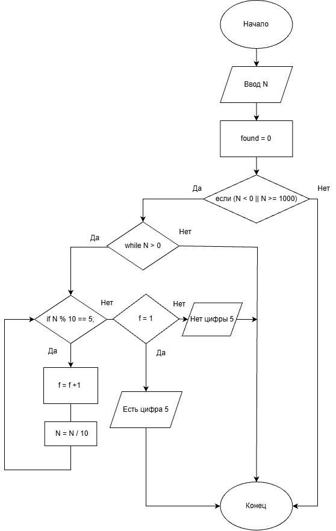

# Домашняя работа 6
## Условие задачи
Вариант 6. 

Дано число N (N<1000). Написать программу, которая проверяет входит ли в него цифра 5.
## 1. Алгоритм и блок-схема

### Алгоритм
1. **Начало**
  
2. Ввод числа N.
3. Проверка, что число N < 1000 и N >= 0.
   - Если да, перейти к следующему шагу
   - Если нет, вывести сообщение об ошибке и завершить
4. Присвоить temp = N
5. Проверка, есть ли в числе цифра 5.
   - Пока temp > 0:
   - Проверить temp % 10 == 5
   - Если да, вывести "В числе есть цифра 5" 
   - Если нет, temp = temp / 10
 6. Если цикл завершён (функция не завершилась досрочно), вывести "В числе нет цифры 5".
7. **Конец**

### Блок-схема

[Ссылка](https://viewer.diagrams.net/?tags=%7B%7D&lightbox=1&highlight=0000ff&edit=_blank&layers=1&nav=1&title=Lab_6.png&dark=auto#R%3Cmxfile%3E%3Cdiagram%20name%3D%22%D0%A1%D1%82%D1%80%D0%B0%D0%BD%D0%B8%D1%86%D0%B0%20%E2%80%94%201%22%20id%3D%22tjUwCf0osmfEOlQWq29F%22%3E7Vxbc5s4FP41ntl9iEcXJMNjnKTtznQ7ncnDNn0jtmyzwciLcWL3168E4ibkGF%2FAdkkmQ%2BAgS%2BKc71w5Tg%2FfzdefQ3cx%2B5uPmd9DYLzu4fseQgjggfgjKZuEAiGmCWUaemNFywmP3i%2BmiEBRV96YLUsDI879yFuUiSMeBGwUlWhuGPK38rAJ98urLtwpqxAeR65fpf7jjaNZQrXRIKd%2FYd50lq4MqZPcmbvpYPUky5k75m8FEn7o4buQ8yg5m6%2FvmC%2B5l%2FIl%2BdynLXezjYUsiOp84Ofw5etfr3T6NKFffixWQXTzEt5YySyvrr9SD6w2G21SDrCxYIi65GE041MeuP5DTh2GfBWMmVwGiKt8zFfOF4IIBfFfFkUbJV13FXFBmkVzX92tPop6uiVfhSP2zv5TSLjhlEXvjMPJOPkshQUUoz4zPmdRuBEDQua7kfdaFr6rMDTNxuVsFieK03twHRq4Tn2x%2F%2BGECw4U2U%2F%2FW0mADF9ZGHkCljeu702DHr6VawQzFnpRzMB0nNQ1Lyx9NOZ3YQCdqr9tryjg4dzL4xD0hNztQXoujvHd4UO6K8HWZGPlzVbIOlZ9XxgGicm3mRexx4Ubo%2BdNGKeaiJNPzdbvYkTdtWy7n5o3Zd2wUvW33FLAVP1nBSthg4aAhboLrFsFIHlMQEZikNHrhpR9dkw5V%2B4iEK3pI8hF%2BQjcXVVGsfqigkKLMAV8O1KRRfy1kKcCQ67vM59PQ3cuBi7EboXIWKjf%2B57f2KX7E2%2FN0uC1OVsArZq2gDZlCyCssLUF3RdMDDc%2FihdPcrI%2BSS%2Fv12ry5GqjrrZKYacpQKc2Beqj37kXa5KSMbFBH6CyvR9oskv2qj5YDO%2B1uSim%2FYEWjug4SGxlZa7bMHQ3hWELOWC5fduUAOM6W7emjU%2BfMUdisoMclxmLD4cq6ab97MKKeXAHC7mDLSb4QzgJgS3qzqWBVm4BAEkc3Mnf2I3kI5L55JIAAgD%2B3NfFHOWQwhmfP6%2BW7USWVFgaWNZaZPAmA2FESJsJC%2BimmuapcAJkdCSWBAyiMmjUVu9HAjRxCJM%2BxK26MffG48Q%2Fs6X3y32Op5JuU5l%2FMS8Z9si9eohlHt0so5C%2FsDvuc%2FmsAQ9YHAL5vkY6AW6ppbkaZFdAaxkiINwYYDucYluqXvMBVaOJxRcGVWwqM15V5o7rhut2I%2FH6vnEx0oyVZbUQ56JqoUCEE0J0xlAnDobOGIdgoCmJU1WSlkumgyvXktpKQhtRkmpSa9klEVcM3JYsdOdEWcC6IzU%2BmWbRCjImUsxSq%2BKUwaBKJRi0VDB2zOw%2BW5EIm2L6a9Ko1J3sVinnIv0OIW34HbsiZW%2BSOR0SZ9RKU2JlIedOgaGtccmU%2F7breqqvViaZcYnP0BBmDjx4Xi5MPGyBcw4pcY4a6tBOqxamTttCML6V%2FR8yr%2FDd5dIblflSti9s7UVZhVmcFwrM4iqvL8uLtLyclaULlein4r19y9InDIhr2qWCAIlBgCnt2IhAq%2F%2BSmnXpaiFZix4JrBcR7GtQ9Q23EsjjarhRzro7kkdnZiNlPqxam3bzaEOGYKjfdUQ8mThS8YBzi6dOg8J%2BzuBAw546kfS8jhM53BmQur6gbu%2FbhzMwroM1e6S97WzGGViG2l0XnQF0NCEb6kWtWhsLfTiDgq%2FWcyp4bvGY2qZazwwON%2Bq1K9lXZqyxDhR9ooZreZapHeQkuMix8FRAya6MsXeaRqbdeHLqRgm%2FKfDg4DDgHVuDs%2BH7PVEQHzeetBGFpEI4cyX36Hh8DxU9XNUsswbVaTxu5kWMhZy%2BU%2FwpAYgO7FqKUDXlDioj0dEmOlGXIaZa1VH1L23dlz7ebiNOr1bB8xJutVm21VetcHdsBqHBhNuoT7Zj7ajwjGxJa7Juvjh6lkfZqqe%2Bv5E098lzKz6CNAcCpMLgK2vyxsCM2fO9vCNb8puuJZ5YixsoAKlWnCu3IYbcprupp6WXfwyv89oVT2MvpS47xSB1wxxkjI%2BuPsNorw5Z9hXtfIvCkDcbbM47rloch7%2BDq7ZQmf0EI4NDgMCE2MbCKcMrw9OYnMPeg7dlcqy6DTqk7nc6O2JzTmYW6jRNXnCZ9cJwQbcUd%2FZvmdwFsKZxUU2H9f6lb1l6nHSKfeolnWJ6ptxyJyV0aL%2F87cmBoZHSpn0KqzCw9o8pxWX%2Br18S9uf%2FQQc%2F%2FA8%3D%3C%2Fdiagram%3E%3C%2Fmxfile%3E)

## 2. Реализация программы
    #include <stdio.h>
    #define _CRT_SECURE_NO_DEPRECATE
    #include <stdlib.h>
    #include <locale.h>
    #define _USE_MATH_DEFINES
    #include <math.h>
    int main() {
        int N;
        int temp;
        int found = 0;
        setlocale(LC_ALL, "RUS");
        printf("Введите число N (меньше 1000): ");
        scanf("%d", &N)
      if (N < 0 || N >= 1000) {
          printf("Число должно быть меньше 1000 и неотрицательным.\n");
          return 1;
      }

      temp = N;
      while (temp > 0) {
          if (temp % 10 == 5) {
              found = 1;
              break;
          }
          temp /= 10;
      }

      if (found) {
          printf("В числе %d есть цифра 5.\n", N);
      }
      else {
          printf("В числе %d нет цифры 5.\n", N);
      }

      return 0;

## 3. Результаты работы программы

Sample Input:
  - 15

Sample Output:
 - В числе 15 есть цифра 5

## 4. Информация о разработчике

Гусев Степан, бИЦ-251
